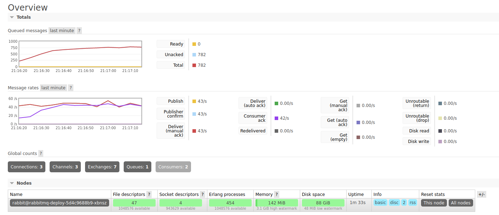
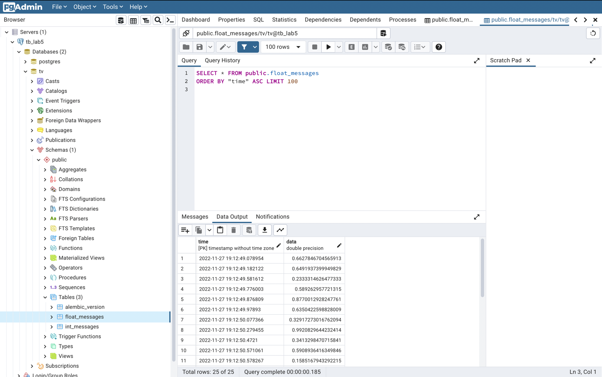

# Links
- GitHub: https://github.com/smthngslv/tv-lab5
- DockerHub: https://hub.docker.com/r/smthngslv/tv-lab5

# Task #1
1. I've created a simple dockerfile (`./benchmark/Dockerfile`) from ubuntu image.

2. To build and run it, I've used these commands:
```shell
# Building and tagging.
docker build -t tv-lab5-benchmark ./benchmark

# Running.
docker run tv-lab5-benchmark
```

3. In file `./benchmark/benchmark.sh` I start the `sysbench`

4. I don't have LXC from 4th lab, but here are results of Docker container benchmark:
   1. `sysbench --threads=$threads --time=60 cpu --cpu-max-prime=64000 run`, `$threads` = {2, 10, 100}

        | Statistic   | 2 threads | 10 threads | 100 threads |
        | ----------- | --------- | ---------- | ----------- |
        | CPU event/s | 180.140   | 364.876    | 375.523     |

   2. `sysbench --num-threads=64 threads --thread-yields=100 --thread-locks=2 run`
       
        | Statistic     | Value   |
        | ------------- | ------- |
        | Total time, s | 10.008  |
        | Total events  | 30320.5 |
   
   3. `sysbench --threads=$threads --time=60 memory --memory-oper=write run`, `$threads` = {2, 10, 100}

        | Statistic        | 2 threads | 10 threads | 100 threads |
        | ---------------- | --------- | ---------- | ----------- |
        | Total time, s    | 14.938    | 6.159      | 5.951       | 
        | Mem speed, MiB/s | 7247.013  | 16625.626  | 17204.986   |

   4. `sysbench memory --memory-block-size=1M --memory-total-size=10G run`

        | Statistic        | Value     |
        | ---------------- | --------- |
        | Total time, s    | 0.514     |
        | Mem speed, MiB/s | 19834.633 |

   5. `sysbench fileio --file-total-size=90G --file-test-mode=rndrw --time=120 --max-time=300 --max-requests=0 run`

        | Statistic      | Value     |
        |----------------| --------- |
        | Prepare, MiB/s | 254.50    |
        | Read, MiB/s    | 6.696     |
        | Written, MiB/s | 4.466     |
     
Comparing results to the `multipass` from lab 3, Docker containers provide better CPU and disk access speed, but give 
less performance in multithread tasks.

# Task #2
1. I've implemented consumer in `./src/lab5/queue/consumer.py`. It consumes messages
from the queue and inserts it in two different `PostgreSQL` tables depending on 
it type.

2. In docker (`./docker/lab5.Dockerfile`) file I use base `python:3.10` image, install dependencies, create a 
non-root user, copy source code and configs. 

3. Variables are passed via environment. You can pass them as `.env` file or `-e` argument.
```shell
docker run --env-file ./.env smthngslv/tv-lab5:latest bash -c \
  "cd ./src && alembic -c ../config/alembic.ini upgrade head && python main.py --consumer"
```

4. You can build and push image via `docker`
```shell
docker build -t smthngslv/tv-lab5:latest .
docker push smthngslv/tv-lab5:latest
```

# Task #3
In `docker-compose.yaml` file I've declared 4 services. They are consumer, 
producer, rabbitmq and postgres. For all services I've set limits for CPU and RAM.
Also, in URLs, that help to connect to RabbitMQ or PostgreSQL I use hosts like
`postgres` and `rabbitmq`. These hosts are generated by docker compose and are
accessible inside the containers. Also, I map port for RabbitMQ management plugin.

You can run it via:
```shell
docker compose up -d
```

Now you can go to the http://localhost:15672' to RabbitMQ rates, use `tv` 
as login and password. Also, you can access PostgreSQL with same login and password.


# Task #4
In `./k8s` I've declared same structure as in `docker-compose.yaml`.
You can run it via
```shell
cd k8s
kubectl apply -R -f .
```
and it prints
```shell
deployment.apps/consumer-deploy created
deployment.apps/postgres-deploy created
service/postgres created
deployment.apps/producer-deploy created
deployment.apps/rabbitmq-deploy created
service/rabbitmq-console created
service/rabbitmq created
```

We can get pods:
```shell
kubectl get deploy,svc
```
```shell
NAME                              READY   UP-TO-DATE   AVAILABLE   AGE
deployment.apps/consumer-deploy   3/3     3            3           36s
deployment.apps/postgres-deploy   1/1     1            1           36s
deployment.apps/producer-deploy   1/1     1            1           36s
deployment.apps/rabbitmq-deploy   1/1     1            1           36s

NAME                       TYPE        CLUSTER-IP      EXTERNAL-IP   PORT(S)           AGE
service/kubernetes         ClusterIP   10.96.0.1       <none>        443/TCP           3h5m
service/postgres           ClusterIP   10.103.58.249   <none>        5432/TCP          36s
service/rabbitmq           ClusterIP   10.102.94.110   <none>        5672/TCP          36s
service/rabbitmq-console   NodePort    10.105.35.216   <none>        15672:32487/TCP   36s
```

To be able to access RabbitMQ management:
```shell
minikube service rabbitmq-console
```

We can check `RabbitMQ` stats:


Same for `PostgreSQL`:

